<h2>Tensorflow-Image-Segmentation-Pap-Smear (2024/03/14)</h2>

This is an experimental Image Segmentation project for Pap-Smear based on
the <a href="https://github.com/sarah-antillia/Tensorflow-Image-Segmentation-API">Tensorflow-Image-Segmentation-API</a>, and
<a href="https://drive.google.com/file/d/1s6TYPD8nSto8X_M6u3ectf-RdXFVk-1M/view?usp=sharing">Smear2005-Seamless-ImageMask-Dataset-V2.zip</a>

 
Please see also our first experiment <a href="https://github.com/sarah-antillia/Image-Segmentation-Pap-Smear">Image-Segmentation-Pap-Smear</a>. 

 
Segmentation samples 
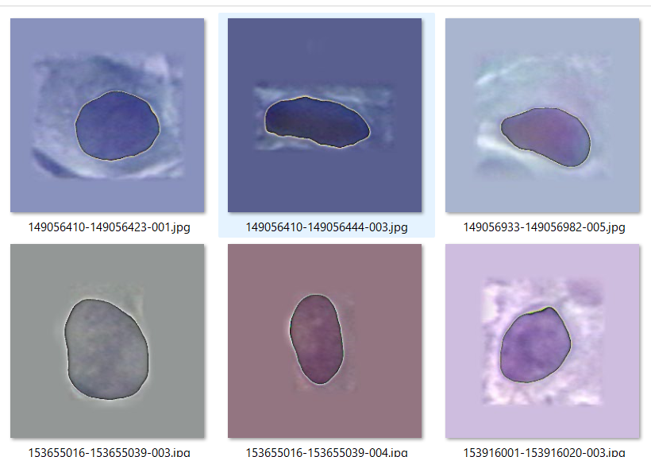
 
 

In order to improve segmentation accuracy, we will use an online dataset augmentation strategy based on Python script <a href="./src/ImageMaskAugmentor.py">
ImageMaskAugmentor.py</a> to train a Pap-Smear Segmentation Model. 
 
As a first trial, we use the simple UNet Model 
<a href="./src/TensorflowUNet.py">TensorflowSlightlyFlexibleUNet</a> for this Pap-Smear Segmentation. 
As shown in <a href="https://github.com/sarah-antillia/Tensorflow-Image-Segmentation-API">Tensorflow-Image-Segmentation-API</a>.
you may try other Tensorflow UNet Models: 

<li><a href="./src/TensorflowSwinUNet.py">TensorflowSwinUNet.py</a></li>
<li><a href="./src/TensorflowMultiResUNet.py">TensorflowMultiResUNet.py</a></li>
<li><a href="./src/TensorflowAttentionUNet.py">TensorflowAttentionUNet.py</a></li>
<li><a href="./src/TensorflowEfficientUNet.py">TensorflowEfficientUNet.py</a></li>
<li><a href="./src/TensorflowUNet3Plus.py">TensorflowUNet3Plus.py</a></li>
 

<h3>1. Dataset Citatiion</h3>

The image dataset used here has been taken from the following web site. 

<pre>
PAP-SMEAR (DTU/HERLEV) DATABASES & RELATED STUDIES
https://mde-lab.aegean.gr/index.php/downloads/
Part II : smear2005.zip [85.17 MB] New Pap-smear Database (images)
</pre>
<pre>
This is the new website that hosts the DTU/Herlev Pap Smear Databases, as well as selected studies and papers 
related to these data. For more than 10 years, Dr Jan Jantzen works on pap-smear data acquired from images of 
healthy & cancerous smears coming from the Herlev University Hospital (Denmark), thanks to Dr MD Beth Bjerregaard.
The Old Pap Smear Database was formed in the late 90’s while the New Pap Smear Database (improved) was formed 
within 2005. The analysis of these databases was made through several Master Theses most of which where elaborated 
in Denmark, under the supervision of Dr Jantzen, while he was joining DTU, Dept. of Automation (Denmark) and also 
through collaboration to other researchers from around the world, many of which were made with G.Dounias and his
research team of the MDE-Lab, University of the Aegean. During the last years, Dr Jantzen collaborates with the 
University of the Aegean, Dept. of Financial and Management Engineering (FME) as teaching associate of the 
Postgraduate Program of the FME-Dept. and as research associate of the MDE-Lab. The site will be continuously 
updated with new papers, studies, theses and citations related to the hosted pap-smear databases.

In case you use material from this site, please cite the current link and related studies.
</pre>

 

<h3>
<a id="2">
2 Pap-Smear ImageMask Dataset
</a>
</h3>
 If you would like to train this Pap-Smear Segmentation model by yourself,
please download the ImageMask-Dataset-Pap-Smear-V2 created by us from the google drive
<a href="https://drive.google.com/file/d/1s6TYPD8nSto8X_M6u3ectf-RdXFVk-1M/view?usp=sharing">Smear2005-Seamless-ImageMask-Dataset-V2.zip</a>
 
 
Please expand the downloaded ImageMaskDataset and place them under <b>./dataset</b> folder to be

<pre>
./dataset
└─./Pap-Smear
    └─severe_dysplastic
        ├─test
        │  ├─images
        │  └─masks
        ├─train
        │  ├─images
        │  └─masks
        └─valid
            ├─images
            └─masks
</pre>

</pre>
 
 
<b>Pap-Smear severe_dysplastic statistics</b> 
 

As shown above, the number of images of train and valid dataset is not necessarily large.
 

<h3>
<a id="3">
3 TensorflowSlightlyFlexibleUNet
</a>
</h3>
This <a href="./src/TensorflowUNet.py">TensorflowUNet</a> model is slightly flexibly customizable by a configuration file. 
For example, <b>TensorflowSlightlyFlexibleUNet/Pap-Smear</b> model can be customizable
by using <a href="./projects/TensorflowSlightlyFlexibleUNet/Pap-Smear/train_eval_infer.config">train_eval_infer.config</a>
<pre>
; train_eval_infer.config
; 2024/04/14 (C) antillia.com

[model]
model         = "TensorflowUNet"
image_width    = 512
image_height   = 512
image_channels = 3
num_classes    = 1
base_filters   = 16
base_kernels   = (3,3)
num_layers     = 7
dropout_rate   = 0.02
learning_rate  = 0.0001
clipvalue      = 0.5
dilation       = (2,2)
;loss           = "bce_iou_loss"
loss           = "bce_dice_loss"
metrics        = ["binary_accuracy"]
show_summary   = False

[train]
epochs        = 100
batch_size    = 4
steps_per_epoch  = 200
validation_steps = 100
patience      = 10
;metrics       = ["iou_coef", "val_iou_coef"]
metrics       = ["binary_accuracy", "val_binary_accuracy"]
model_dir     = "./models"
eval_dir      = "./eval"
image_datapath = "../../../dataset/Pap-Smear/severe_dysplastic/train/images/"
mask_datapath  = "../../../dataset/Pap-Smear/severe_dysplastic/train/masks/"
create_backup  = False
learning_rate_reducer = True
reducer_patience      = 4
save_weights_only = True

[eval]
image_datapath = "../../../dataset/Pap-Smear/severe_dysplastic/valid/images/"
mask_datapath  = "../../../dataset/Pap-Smear/severe_dysplastic/valid/masks/"

[test] 
image_datapath = "../../../dataset/Pap-Smear/severe_dysplastic/test/images/"
mask_datapath  = "../../../dataset/Pap-Smear/severe_dysplastic/test/masks/"

[infer] 
images_dir    = "../../../dataset/Pap-Smear/severe_dysplastic/test/images/"
output_dir    = "./test_output"
merged_dir    = "./test_output_merged"

[segmentation]
colorize      = False
black         = "black"
white         = "green"
blursize      = None

[mask]
blur      = False
blur_size = (3,3)
binarize  = True
threshold = 128

</pre>

    

<h3>
3.1 Training
</h3>
Please move to a <b>./projects/TensorflowSlightlyFlexibleUNet/Pap-Smear</b> folder, 
and run the following bat file to train TensorflowUNet model for Pap-Smear. 
<pre>
./1.train_generator.bat
</pre>
, which simply runs <a href="./src/TensorflowUNetGeneratorTrainer.py">TensorflowUNetGeneratorTrainer.py </a>
in the following way.

<pre>
python ../../../src/TensorflowUNetGeneratorTrainer.py ./train_eval_infer.config
</pre>
Train console output: 
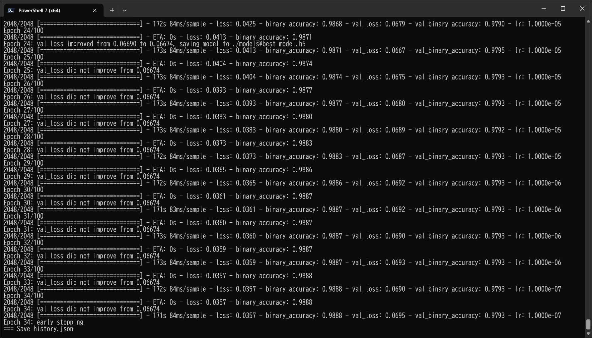 
Train metrics: 
 
Train losses: 
 
 

<h3>
3.2 Evaluation
</h3>
Please move to a <b>./projects/TensorflowSlightlyFlexibleUNet/Pap-Smear</b> folder, 
and run the following bat file to evaluate TensorflowUNet model for Pap-Smear. 
<pre>
./2.evaluate.bat
</pre>
<pre>
python ../../../src/TensorflowUNetEvaluator.py ./train_eval_infer_aug.config
</pre>
Evaluation console output: 
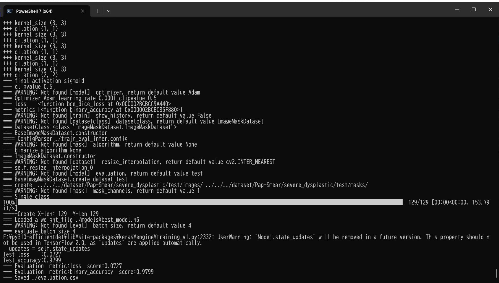
  
As shown below, the loss (bce_dice_loss) is very low, and binary_accuracy is very high.
<pre>
loss,0.0727
binary_accuracy,0.9799
</pre>

<h2>
3.3 Inference
</h2>
Please move to a <b>./projects/TensorflowSlightlyFlexibleUNet/Pap-Smear</b> folder 
,and run the following bat file to infer segmentation regions for images by the Trained-TensorflowUNet model for Pap-Smear. 
<pre>
./3.infer.bat
</pre>
<pre>
python ../../../src/TensorflowUNetInferencer.py ./train_eval_infer_aug.config
</pre>

Sample test images 
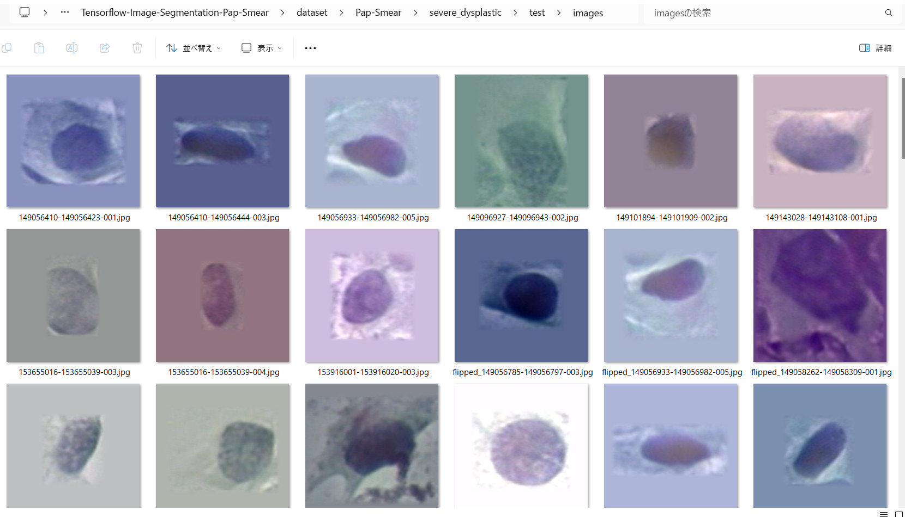 
Sample test mask (ground_truth) 
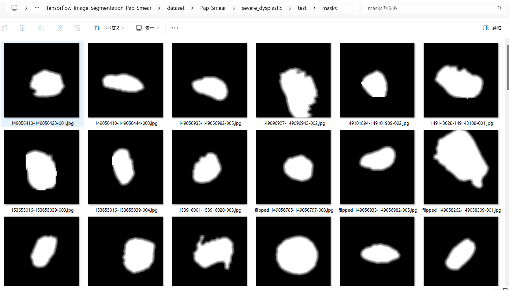 

 
Inferred test masks 
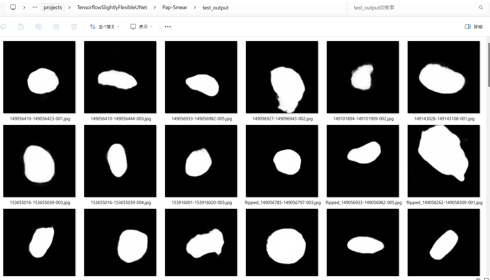 
 
Merged test images and inferred masks  
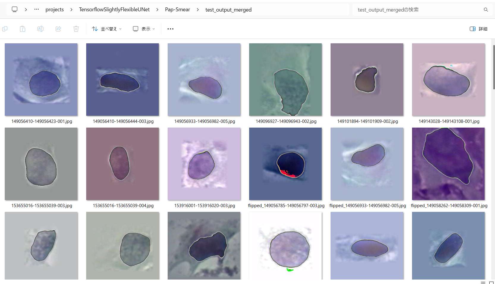  

Enlarged samples 
<table>
<tr>
<td>
test/images/149056410-149056423-001.jpg 
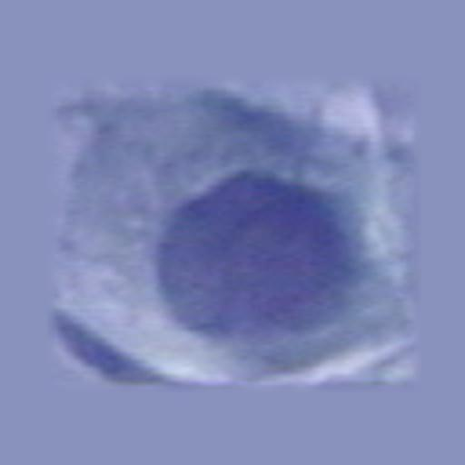

</td>
<td>
Inferred merged/149056410-149056423-001.jpg 

</td> 
</tr>

<tr>
<td>
test/images/149096927-149096943-002.jpg 
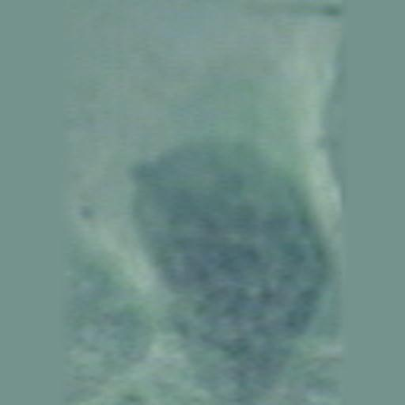

</td>
<td>
Inferred merged/149096927-149096943-002.jpg 
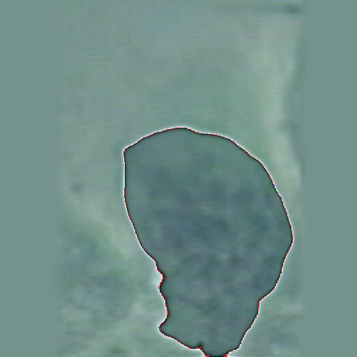
</td> 
</tr>

<tr>
<td>
test/images/153916001-153916020-003.jpg 
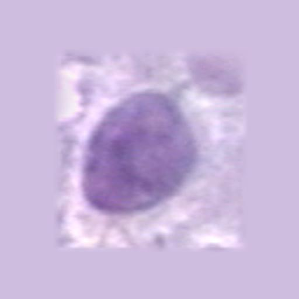

</td>
<td>
Inferred merged/153916001-153916020-003.jpg 
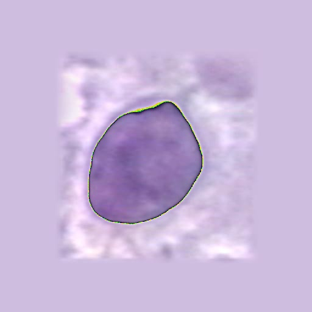
</td> 
</tr>

<tr>
<td>
test/images/flipped_149056785-149056797-003.jpg 
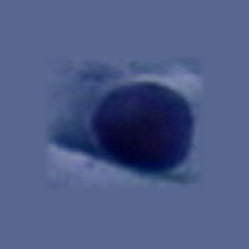

</td>
<td>
Inferred merged/flipped_149056785-149056797-003.jpg 
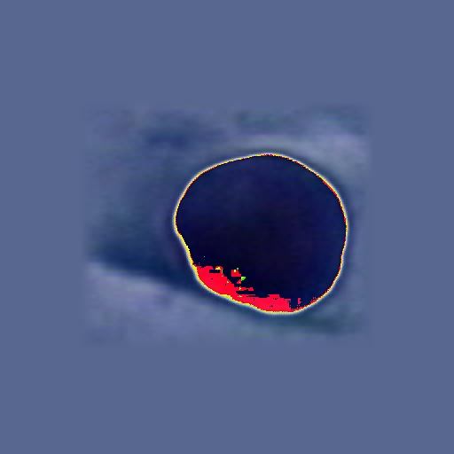
</td> 
</tr>

<!-- 5-->
<tr>
<td>
test/images/mirrored_149316754-149316795-002.jpg 
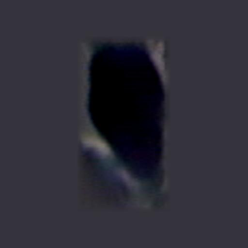

</td>
<td>
Inferred merged/mirrored_149316754-149316795-002.jpg 
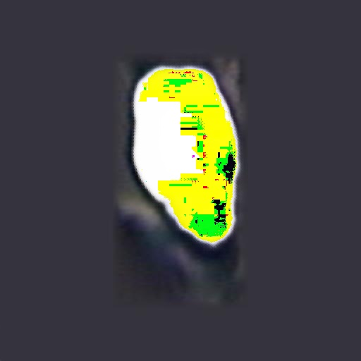
</td> 
</tr>

</table>

<h3>
References
</h3>
<b>1. PAP-SMEAR (DTU/HERLEV) DATABASES & RELATED STUDIES</b> 
<pre>
https://mde-lab.aegean.gr/index.php/downloads/
</pre>

<b>2. Liquid based cytology pap smear images for multi-class diagnosis of cervical cancer</b> 
<pre>
https://data.mendeley.com/datasets/zddtpgzv63/4
</pre>

<b>3. Pap-smear Benchmark Data For Pattern Classification </b>
Jan Jantzen, Jonas Norup , George Dounias , Beth Bjerregaard 
<pre>
https://www.researchgate.net/publication/265873515_Pap-smear_Benchmark_Data_For_Pattern_Classification
</pre>
<b>4. Deep Convolution Neural Network for Malignancy Detection and Classification in Microscopic Uterine Cervix Cell Images</b> 
Shanthi P B,1 Faraz Faruqi, Hareesha K S, and Ranjini Kudva 
<pre>
https://www.ncbi.nlm.nih.gov/pmc/articles/PMC7062987/
</pre>

<b>5. DeepCyto: a hybrid framework for cervical cancer classification by using deep feature fusion of cytology images</b> 
Swati Shinde, Madhura Kalbhor, Pankaj Wajire 
<pre>
https://www.aimspress.com/article/doi/10.3934/mbe.2022301?viewType=HTML#b40
</pre>

<b>6. EfficientNet-Pap-Smear</b> 
Toshiyuki Arai @antillia.com 
<pre>
https://github.com/atlan-antillia/EfficientNet-Pap-Smear
</pre>

<b>7. ImageMask-Dataset-Pap-Smear</b> 
Toshiyuki Arai @antillia.com 
<pre>
https://github.com/sarah-antillia/ImageMask-Dataset-Pap-Smear
</pre>

