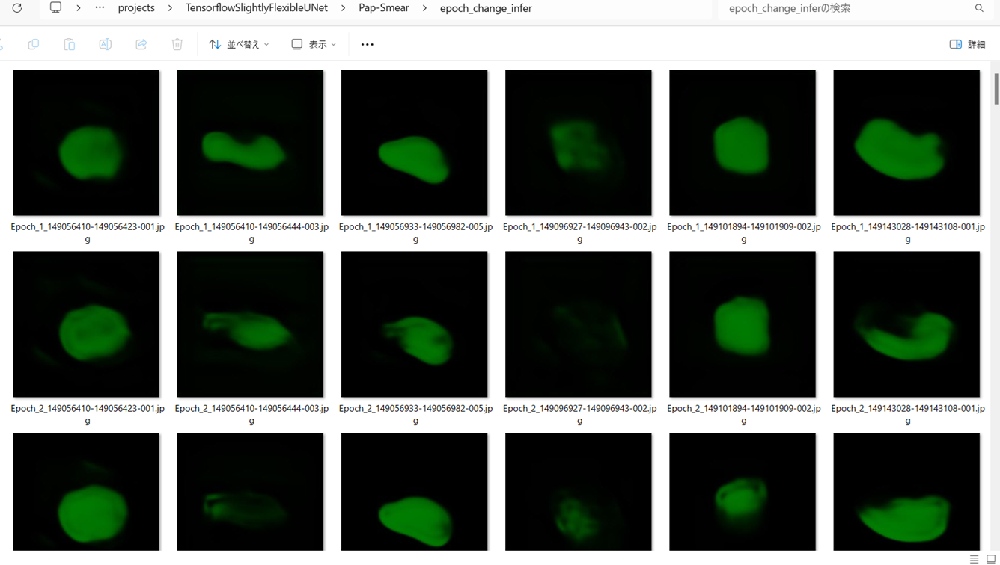
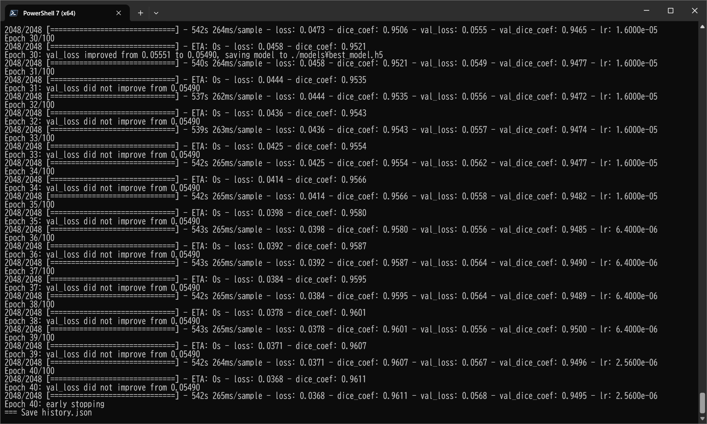
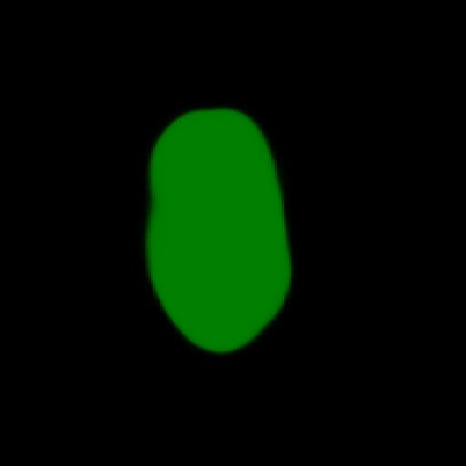

<h2>Tensorflow-Image-Segmentation-Pap-Smear (Updated: 2025/05/07)</h2>

Sarah T. Arai 
Software Laboratory antillia.com  

<li>2025/05/07: Updated to use the latest Tensorflow-Image-Segmentation-API</li>
 
This is the first experiment of Image Segmentation for Pap-Smear 
 based on 
the latest <a href="https://github.com/sarah-antillia/Tensorflow-Image-Segmentation-API">Tensorflow-Image-Segmentation-API</a>, 
and  <a href="https://drive.google.com/file/d/1s6TYPD8nSto8X_M6u3ectf-RdXFVk-1M/view?usp=sharing">Smear2005-Seamless-ImageMask-Dataset-V2.zip</a>
, which was derived by us from <a href="https://mde-lab.aegean.gr/index.php/downloads/">
PAP-SMEAR (DTU/HERLEV) DATABASES & RELATED STUDIES 
Part II : smear2005.zip [85.17 MB] New Pap-smear Database (images)
</a>
 
 
Please see also our first experiment <a href="https://github.com/sarah-antillia/Image-Segmentation-Pap-Smear">Image-Segmentation-Pap-Smear</a>. 
 

<b>Actual Image Segmentation for Images of 512x512pixels</b> 
As shown below, the inferred masks look similar to the ground truth masks.  

<table>
<tr>
<th>Input: image</th>
<th>Mask (ground_truth)</th>
<th>Prediction: inferred_mask</th>
</tr>
<tr>
<td></td>
<td></td>
<td></td>
</tr>

<tr>
<td></td>
<td></td>
<td></td>
</tr>

<tr>
<td></td>
<td></td>
<td></td>
</tr>
</table>

 
In this experiment, we used the simple UNet Model 
<a href="./src/TensorflowUNet.py">TensorflowSlightlyFlexibleUNet</a> for this Pap-SmearSegmentation Model. 
As shown in <a href="https://github.com/sarah-antillia/Tensorflow-Image-Segmentation-API">Tensorflow-Image-Segmentation-API</a>.
you may try other Tensorflow UNet Models: 

<li><a href="./src/TensorflowSwinUNet.py">TensorflowSwinUNet.py</a></li>
<li><a href="./src/TensorflowMultiResUNet.py">TensorflowMultiResUNet.py</a></li>
<li><a href="./src/TensorflowAttentionUNet.py">TensorflowAttentionUNet.py</a></li>
<li><a href="./src/TensorflowEfficientUNet.py">TensorflowEfficientUNet.py</a></li>
<li><a href="./src/TensorflowUNet3Plus.py">TensorflowUNet3Plus.py</a></li>
<li><a href="./src/TensorflowDeepLabV3Plus.py">TensorflowDeepLabV3Plus.py</a></li>

 

<h3>1. Dataset Citation</h3>
The image dataset used here has been taken from the following web site. 
 
<a href="https://mde-lab.aegean.gr/index.php/downloads/">
PAP-SMEAR (DTU/HERLEV) DATABASES & RELATED STUDIES
 
Part II : smear2005.zip [85.17 MB] New Pap-smear Database (images)
</a>
  
This is the new website that hosts the DTU/Herlev Pap Smear Databases, as well as selected studies and papers  
related to these data. For more than 10 years, Dr Jan Jantzen works on pap-smear data acquired from images of  
healthy & cancerous smears coming from the Herlev University Hospital (Denmark), thanks to Dr MD Beth Bjerregaard. 
The Old Pap Smear Database was formed in the late 90’s while the New Pap Smear Database (improved) was formed  
within 2005. The analysis of these databases was made through several Master Theses most of which where elaborated  
in Denmark, under the supervision of Dr Jantzen, while he was joining DTU, Dept. of Automation (Denmark) and also  
through collaboration to other researchers from around the world, many of which were made with G.Dounias and his 
research team of the MDE-Lab, University of the Aegean. During the last years, Dr Jantzen collaborates with the  
University of the Aegean, Dept. of Financial and Management Engineering (FME) as teaching associate of the  
Postgraduate Program of the FME-Dept. and as research associate of the MDE-Lab. The site will be continuously  
updated with new papers, studies, theses and citations related to the hosted pap-smear databases. 

In case you use material from this site, please cite the current link and related studies. 

 
<h3>
<a id="2">
2 Pap-Smear ImageMask Dataset
</a>
</h3>
 If you would like to train this Pap-Smear Segmentation model by yourself,
 please download our 512x512 pixels dataset from the google drive  
 If you would like to train this Pap-Smear Segmentation model by yourself,
please download the ImageMask-Dataset-Pap-Smear-V2 created by us from the google drive
<a href="https://drive.google.com/file/d/1s6TYPD8nSto8X_M6u3ectf-RdXFVk-1M/view?usp=sharing">Smear2005-Seamless-ImageMask-Dataset-V2.zip</a>
 , 
expand the downloaded ImageMaskDataset and put it under <b>./dataset</b> folder to be
<pre>
./dataset
 └─Pap-Smear
     └─severe_dysplastic
        ├─test
        │   ├─images
        │   └─masks
        ├─train
        │   ├─images
        │   └─masks
        └─valid
            ├─images
            └─masks
</pre>
 
<b>Pap-Smear Statistics</b> 
 
 
As shown above, the number of images of train and valid datasets is not enough to use for a training set of our segmentation model.
 
 
<b>Train_images_sample</b> 

 
 
<b>Train_masks_sample</b> 

 

<h3>
3 Train TensorflowUNet Model
</h3>
 We trained Pap-Smear TensorflowUNet Model by using the following
<a href="./projects/TensorflowSlightlyFlexibleUNet/Pap-Smear/train_eval_infer.config"> <b>train_eval_infer.config</b></a> file.  
Please move to ./projects/TensorflowSlightlyFlexibleUNet/Pap-Smearand run the following bat file. 
<pre>
>1.train.bat
</pre>
, which simply runs the following command. 
<pre>
>python ../../../src/TensorflowUNetTrainer.py ./train_eval_infer.config
</pre>

<b>Model parameters</b> 
Defined a small <b>base_filters</b> and large <b>base_kernels</b> for the first Conv Layer of Encoder Block of 
<a href="./src/TensorflowUNet.py">TensorflowUNet.py</a> 
and a large num_layers (including a bridge between Encoder and Decoder Blocks).
<pre>
[model]
base_filters   = 16
base_kernels   = (9,9)
num_layers     = 8
dilation       = (3,3)
</pre>

<b>Learning rate</b> 
Defined a small learning rate.  
<pre>
[model]
learning_rate  = 0.00007
</pre>

<b>Online augmentation</b> 
Enabled our online augmentation tool. 
<pre>
[model]
model         = "TensorflowUNet"
generator     = True
</pre>

<b>Loss and metrics functions</b> 
Specified "bce_dice_loss" and "dice_coef". 
<pre>
[model]
loss           = "bce_dice_loss"
metrics        = ["dice_coef"]
</pre>
<b >Learning rate reducer callback</b> 
Enabled learing_rate_reducer callback, and a small reducer_patience.
<pre> 
[train]
learning_rate_reducer = True
reducer_factor     = 0.4
reducer_patience   = 4
</pre>

<b>Early stopping callback</b> 
Enabled early stopping callback with patience parameter.
<pre>
[train]
patience      = 10
</pre>

<b>Epoch change inference callbacks</b> 
Enabled epoch_change_infer callback. 
<pre>
[train]
epoch_change_infer       = True
epoch_change_infer_dir   =  "./epoch_change_infer"
epoch_changeinfer        = False
epoch_changeinfer_dir    = "./epoch_changeinfer"
num_infer_images         = 6
</pre>

By using this epoch_change_infer callback, on every epoch_change, the inference procedure can be called
 for 6 images in <b>mini_test</b> folder. This will help you confirm how the predicted mask changes 
 at each epoch during your training process.    

<b>Epoch_change_inference output at starting (1,2,3)</b> 
 
 
<b>Epoch_change_inference output at ending (38,39,40)</b> 
 
 

In this experiment, the training process was stopped at epoch 40  by EarlyStopping Callback.  
 
 

<a href="./projects/TensorflowSlightlyFlexibleUNet/Pap-Smear/eval/train_metrics.csv">train_metrics.csv</a> 
 

 
<a href="./projects/TensorflowSlightlyFlexibleUNet/Pap-Smear/eval/train_losses.csv">train_losses.csv</a> 
 
 

<h3>
4 Evaluation
</h3>
Please move to a <b>./projects/TensorflowSlightlyFlexibleUNet/Pap-Smear</b> folder, 
and run the following bat file to evaluate TensorflowUNet model for Pap-Smear. 
<pre>
./2.evaluate.bat
</pre>
This bat file simply runs the following command.
<pre>
python ../../../src/TensorflowUNetEvaluator.py ./train_eval_infer_aug.config
</pre>
Evaluation console output: 

  Image-Segmentation-Pap-Smear

<a href="./projects/TensorflowSlightlyFlexibleUNet/Pap-Smear/evaluation.csv">evaluation.csv</a> 
The loss (bce_dice_loss) to this Pap-Smear/test was low, and dice_coef high as shown below.
 
<pre>
loss,0.0691
dice_coef,0.9389
</pre>
 
<h3>5 Inference</h3>
Please move to a <b>./projects/TensorflowSlightlyFlexibleUNet/Pap-Smear</b> folder 
,and run the following bat file to infer segmentation regions for images by the Trained-TensorflowUNet model for Pap-Smear. 
<pre>
./3.infer.bat
</pre>
This simply runs the following command.
<pre>
python ../../../src/TensorflowUNetInferencer.py ./train_eval_infer_aug.config
</pre>

<b>mini_test_images</b> 
 
<b>mini_test_mask(ground_truth)</b> 
 

<b>Inferred test masks</b> 
 

 

<b>Enlarged images and masks (512x512 pixels)</b> 

<table>
<tr>
<th>Image</th>
<th>Mask (ground_truth)</th>
<th>Inferred-mask</th>
</tr>
<tr>
<td></td>
<td></td>
<td></td>
</tr>

<tr>
<td></td>
<td></td>
<td></td>
</tr>

<tr>
<td></td>
<td></td>
<td></td>
</tr>

<tr>
<td></td>
<td></td>
<td></td>
</tr>
<tr>
<td></td>
<td></td>
<td></td>
</tr>
<tr>
<td></td>
<td></td>
<td></td>
</tr>
</table>

 

<h3>
References
</h3>
<b>1. PAP-SMEAR (DTU/HERLEV) DATABASES & RELATED STUDIES</b> 
<pre>
https://mde-lab.aegean.gr/index.php/downloads/
</pre>

<b>2. Liquid based cytology pap smear images for multi-class diagnosis of cervical cancer</b> 
<pre>
https://data.mendeley.com/datasets/zddtpgzv63/4
</pre>

<b>3. Pap-smear Benchmark Data For Pattern Classification </b>
Jan Jantzen, Jonas Norup , George Dounias , Beth Bjerregaard 
<pre>
https://www.researchgate.net/publication/265873515_Pap-smear_Benchmark_Data_For_Pattern_Classification
</pre>
<b>4. Deep Convolution Neural Network for Malignancy Detection and Classification in Microscopic Uterine Cervix Cell Images</b> 
Shanthi P B,1 Faraz Faruqi, Hareesha K S, and Ranjini Kudva 
<pre>
https://www.ncbi.nlm.nih.gov/pmc/articles/PMC7062987/
</pre>

<b>5. DeepCyto: a hybrid framework for cervical cancer classification by using deep feature fusion of cytology images</b> 
Swati Shinde, Madhura Kalbhor, Pankaj Wajire 
<pre>
https://www.aimspress.com/article/doi/10.3934/mbe.2022301?viewType=HTML#b40
</pre>

<b>6. EfficientNet-Pap-Smear</b> 
Toshiyuki Arai @antillia.com 
<pre>
https://github.com/atlan-antillia/EfficientNet-Pap-Smear
</pre>

<b>7. ImageMask-Dataset-Pap-Smear</b> 
Toshiyuki Arai @antillia.com 
<pre>
https://github.com/sarah-antillia/ImageMask-Dataset-Pap-Smear
</pre>

